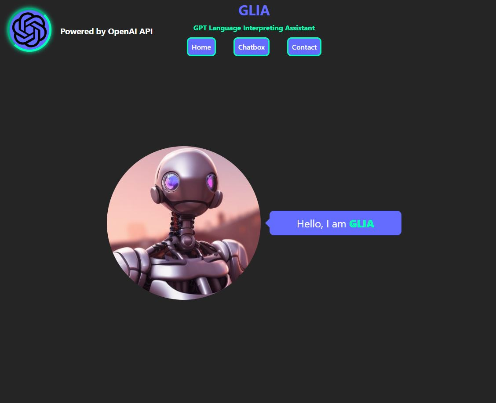

# GLIA - GPT Language Interpreting Assistant
# ***This project is still in development.***
## Description
This is a ChatGPT clone that I have modified the user interface using React and some custom CSS styling.  The original ChatGPT can be found at https://openai.com/.  The api used in this project can be referenced here https://platform.openai.com/docs/api-reference.
 
Live link: https://glia-gpt-language-interpreting-assistant.vercel.app/home
 
 

